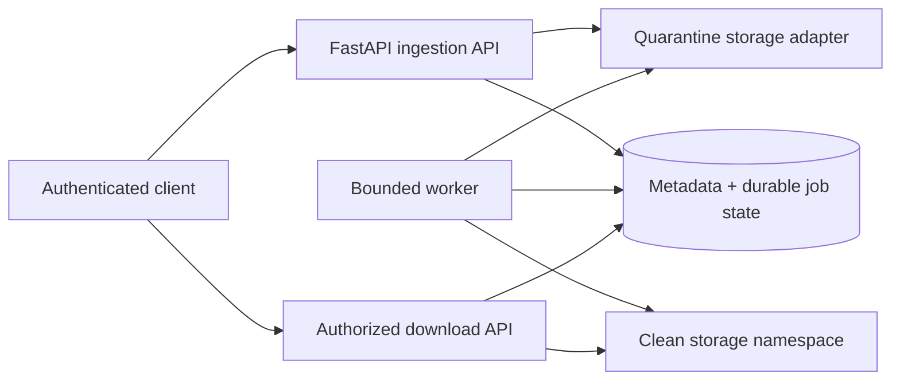

# CloudFileFlow Architecture

Status: Adapter-first local vertical slice implemented and locally verified.

## Boundaries

- `identity`: bearer validation and principal.
- `files`: upload, metadata, ownership, download.
- `storage`: quarantine/clean object adapter.
- `jobs`: durable claim/retry/dead-letter behavior.
- `audit`: immutable-intent application events.
- `configuration`: required secrets, limits, and paths.
- `operations`: fail-closed job counts and sanitized dead-letter inspection.
- `migrations`: explicit Alembic revision checks and schema upgrades.

The initial database-backed queue is a local development substitute. An SQS
adapter must preserve stable IDs, visibility timeout, idempotency, and
dead-letter behavior without changing the application contracts.

## Data model

- `files`: ID, owner, display name, storage key, declared/detected media type,
  bytes, digest, state, timestamps, idempotency key.
- `processing_jobs`: stable ID, file ID, state, attempts, due/claim times,
  sanitized error class.
- `audit_records`: actor, file, action, timestamp, bounded metadata.

## Transaction boundary

The upload service streams into a temporary object, validates the byte limit,
atomically renames it into quarantine, then commits file metadata, one pending
job, and an audit row. The file row is explicitly flushed before dependent
rows, preserving foreign-key ordering. If the database transaction fails, the
quarantine object is removed. A later reconciliation process is required for
process termination between storage rename and commit.

## Worker claim and failure model

The one-shot worker first recovers claims older than the configured timeout.
An atomic state-guarded update changes one due job from `PENDING` to
`PROCESSING` and increments its attempt count. The local SQLite adapter is
intended for one or a small number of cooperative workers; it is not proof of
distributed queue semantics.

Valid content moves to the clean namespace before the metadata transaction. A
database failure restores it to quarantine. Invalid content is staged outside
quarantine, committed as `REJECTED`/`COMPLETED`, and deleted. Transient adapter
failures store only their exception class, schedule exponential retry, and
become `DEAD_LETTER` at the configured maximum. Every state outcome appends a
system audit event.

## Content boundary

- PDF validation checks the `%PDF-` signature.
- JSON must decode as UTF-8 and parse as JSON.
- Plain text must decode as UTF-8.
- Null bytes are rejected for text/JSON.

These checks detect obvious type mismatch; they are not malware scanning.

## Database lifecycle

Alembic revision `20260704_01` creates the file, job, and audit tables,
constraints, indexes, and foreign keys. API and worker startup verify the
database is at the current head. Automatic migration is disabled by default.

## Deployment direction

Local: SQLite and filesystem. The configured container topology runs an ordered
migration job, API, and polling worker against the same explicit local
adapters. Its root filesystems are read-only and processes run without root or
Linux capabilities.

An emulator is deferred until real S3/SQS adapters exist and Docker can execute
their contract tests. Merely adding an unused LocalStack service would not be
cloud evidence. No paid cloud resource is authorized.
